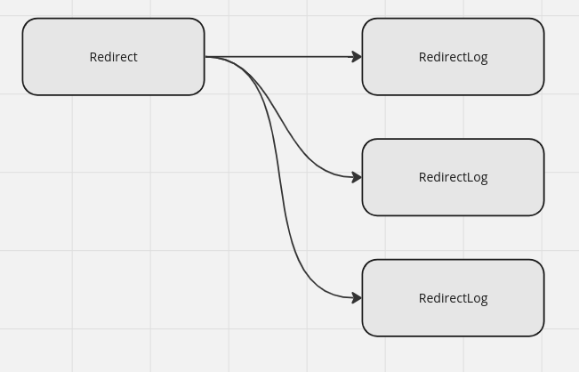
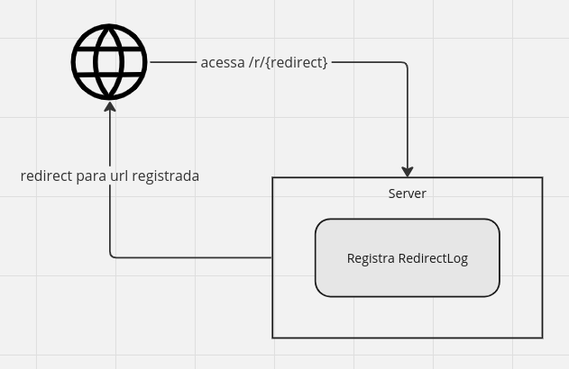

# Payt - Teste Backend

O objetivo do teste é avaliar seu conhecimento em Laravel e respeito às boas práticas de programação e organização de
código.

<!-- TOC -->

* [Payt - Teste Backend](#payt---teste-backend)
    * [Sobre o Projeto](#sobre-o-projeto)
    * [Detalhes e Requisitos](#detalhes-e-requisitos)
    * [Estrutura do Projeto](#estrutura-do-projeto)
        * [Models](#models)
        * [Rotas](#rotas)
    * [Etapas do Projeto](#etapas-do-projeto)
        * [1. Proteção de Ids na API e implementação do attribute code](#1-proteção-de-ids-na-api-e-implementação-do-attribute-code)
        * [2. CRUD de Redirects](#2-crud-de-redirects)
            * [Criação](#criação)
            * [Listagem](#listagem)
            * [Atualização](#atualização)
            * [Deleção](#deleção)
        * [3. Redirecionamento](#3-redirecionamento)
        * [4. Estatísticas de Acesso](#4-estatísticas-de-acesso)
        * [5. Factories e Testes](#5-factories-e-testes)
            * [Testes Essenciais](#testes-essenciais)
    * [Critérios de Avaliação](#critérios-de-avaliação)
    * [Entrega](#entrega)

<!-- TOC -->

---

## Sobre o Projeto

O Plano do projeto é um sistema de redirects, que redirecionará o usuário para a URL destino cadastrada e criará um
registro de acesso.

O desenvolvimento possui 5 etapas:

1. [Proteção de Ids na API com package Hashids](#1-proteção-de-ids-na-api-e-implementação-do-attribute-code)
2. [CRUD de Redirects](#2-crud-de-redirects): uma API RESTful para gerenciar os redirects
3. [Redirecionamento](#3-redirecionamento): Por exemplo, se o usuário acessar `http://localhost:8000/r/ABCD123`,
   ele será redirecionado para `https://google.com` conforme registrado na model.
4. [Estatísticas de Acesso](#4-estatísticas-de-acesso): Endpoint que retorna as estatísticas de acesso do redirect
5. [Factories e Testes](#5-factories-e-testes): Testes unitários e de integração para a API utilizando PHPUnit

---

## Detalhes e Requisitos

- Não se preocupe com a autenticação dos usuários
- Você pode instalar outros pacotes que achar necessário ou forem úteis para o desenvolvimento do projeto
- A estrutura em si está ao seu critério, esta é apenas a ideia inicial. Melhorias no escopo são bem-vindas
- ⚠️ Após a leitura do teste, comece a preencher o arquivo `feedback.md` com suas considerações sobre o teste

---

## Estrutura do Projeto

### Models

| Model       | Descrição                                         |
|-------------|---------------------------------------------------|
| Redirect    | Armazena as informações para execução do redirect |
| RedirectLog | Armazena os logs de acesso ao redirect            |

### Rotas

- `/r/{redirect}`: Redireciona para a URL de destino
- `/api/redirects`: Resource de redirects
- `/api/redirects/{redirect}/stats`: Retorna as estatísticas de acesso do redirect
- `/api/redirects/{redirect}/logs`: Retorna os logs de acesso do redirect

---

## Etapas do Projeto

### 1. Proteção de Ids na API e implementação do attribute code

Os ids na API não devem ser expostos, serão então substituídos por um hash.

- Usando o package `vinkla/hashids`, substitua os Ids dos redirects por um hash
- Crie um atributo `code` que será o hash gerado pelo `hashids` a partir do `id`
- O atributo `code` deve ser utilizado para a busca de um redirect
- Através de Dependency Injection, Controller deve receber a Model já instanciada com o Redirect buscado

### 2. CRUD de Redirects

Utilize o FormRequest para validação dos dados

#### Criação

- Deve ser possível criar um redirect passando apenas a URL de destino no payload em JSON
- Ela pode ou não conter query_params. Exemplo: `https://google.com` ou `https://google.com?src=facebook`
- Url de Destino *deve* de ser HTTPS
- Url de Destino *deve* ser validada retornando um erro caso a URL retorne um status diferente de 200
- Url de Destino *não pode* apontar para a própria aplicação

#### Listagem

- A listagem de redirects, deve retornar as seguintes informações:
    - Código
    - Status (ativo/inativo)
    - URL de destino
    - Último acesso
    - Data de criação
    - Data de atualização

#### Atualização

- Deve ser possível atualizar a URL de destino
- Deve ser possível ativar/desativar o redirect

#### Deleção

- Deve ser possível deletar um redirect
- Quando deletado, o redirect será passado para desativado e receber um SoftDelete

### 3. Redirecionamento

- O redirecionamento deve ser feito através da rota `/r/{redirect}`
- Deve ser feito um registro de acesso no `RedirectLog` com as informações da request
    - Id da Redirect
    - IP da request
    - User-Agent da request
    - Header referer da request
    - Query Params da request
    - Data e hora do acesso
- Se a request vier com query params, eles devem ser passados para a URL de destino
- Se o redirect já possui query params, eles devem ser fundidos com os da request, a request tem prioridade
- Se a request vier com um query params que possuem valores vazios, eles devem ser ignorados
- Se a request vier com query params vazios e o redirect possuir a chave

### 4. Estatísticas de Acesso

- Deve ser possível acessar as estatísticas de acesso de um Redirect através `/api/redirects/{redirect}/stats`
- Estatísticas de acesso devem conter:
    - Total de acessos
    - Total de acessos Ùnicos (IPs únicos)
    - Top Referrers (Headers referer mais comum entre os Redirecionamentos)
    - Uma array com total de acessos dos últimos 10 dias (Ex: `[{ "date": "2021-01-01": "total": 10, "unique": 8 }]`)

---

### 5. Factories e Testes

Crie as factories para os models e os testes para a API  
Usando o PHPUnit, crie testes unitários e de integração para a API

#### Testes Essenciais

1. Criação de um redirect
    - Criação do redirect com URL válida
    - Criação do redirect com URL inválida por
        - DNS inválido
        - URL inválida
        - URL apontando para a própria aplicação
        - URL sem HTTPS
        - URL retornando status diferente de 200 ou 201
        - URL inválida pois possui query params com chave vazia
2. Um teste para validação das estatísticas de acesso
    - Verificar se os redirects vindo do mesmo ip são contados como um único acesso no total de acessos únicos
    - Verificar se os headers referer são contados corretamente
    - Verificar se os acessos dos últimos 10 dias estão corretos
    - Verificar se os acessos dos últimos 10 dias estão corretos quando não há acessos
    - Verificar se os acessos dos últimos 10 dias estão corretos quando há acessos
    - Verificar se os acessos estão pegando somente os últimos 10 dias
3. Um teste para validação dos query params inseridos na URL de destino

| Merge Test                             | Query Params da Request         | Query Params no Redirect               | Resultado                               |
|----------------------------------------|---------------------------------|----------------------------------------|-----------------------------------------|
| Juntando duas origens                  | `utm_source=facebook`           | `utm_campaign=ads`                     | `utm_source=facebook&utm_campaign=ads`  |
| Priorizando à Request                  | `utm_source=instagram`          | `utm_source=facebook&utm_campaign=ads` | `utm_source=instagram&utm_campaign=ads` |
| Merge ignorando chave vazia na Request | `utm_source=&utm_campaign=test` | `utm_source=facebook`                  | `utm_source=facebook&utm_campaign=test` |

---

## Critérios de Avaliação

- Organização do código(reusabilidade, legibilidade e manutenibilidade)
- Performance das queries
- Testes unitários e de integração
- Estrutura no banco de dados, indexes, chaves estrangeiras, etc
- Estrutura de commits

---

## Entrega

- Clone este repositório
- O projeto deve ser entregue em um repositório público no Github ou enviado por email contendo o `.git` para comparação
  com o projeto inicial
- Não esqueça de preencher o arquivo `feedback.md` com suas considerações finais

